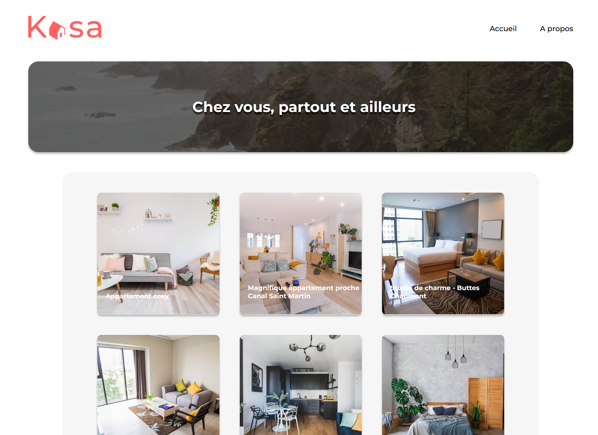

 

# Kasa - Real estate renting app

## Description

Fifth project of the OpenClassrooms Web Developer course

## Technologies

-   React
-   SCSS

## Libraries

-   Create-React-App
-   React-Router-Dom

## Code Architecture

    
kasa_main

    <ul>
        <li>

            
public

            - index.html 
            - robots.txt
        
</li>
        <li>

            
src

            <ul>
                <li>

                    
app

                    <ul>
                        <li>

                            
components

                            <ul>
                                <li>Banner.jsx</li>
                                <li>Card.jsx</li>
                                <li>Collapse.jsx</li>
                                <li>Footer.jsx</li>
                                <li>Header.jsx</li>
                                <li>Host.jsx</li>
                                <li>Rating.jsx</li>
                                <li>Slideshow.jsx</li>
                                <li>Tag.jsx</li>
                            </ul>
                        
</li>
                        <li>

                            
layout

                            <ul>
                                <li>Default.jsx</li>
                            </ul>
                        
</li>
                        <li>

                            
pages

                            <ul>
                                <li>About.jsx</li>
                                <li>Accomodation.jsx</li>
                                <li>Error404.jsx</li>
                                <li>Home.jsx</li>
                            </ul>
                        
</li>
                        <li>- Routes.jsx : page router</li>
                    </ul>
                
</li>
                <li>

                    
assets

                    <ul>
                        <li>arrow_back_ios-24px 2.png</li>
                        <li>coast-background.webp</li>
                        <li>lake_mountain.webp</li>
                        <li>logo-orange.png</li>
                        <li>logo-white.png</li>
                    </ul>
                
</li>
                <li>

                    
css

                    <ul>
                        <li>style.css</li>
                        <li>style.css.map</li>
                    </ul>
                
</li>
                <li>

                    
datas

                    <ul>
                        <li>about-content.json</li>
                        <li>accomodation.json</li>
                    </ul>
                
</li>
                <li>

                    
sass

                    <ul>
                        <li>

                            
base

                            <ul>
                                - _base.scss 
                                - _variables.scss
                            </ul>
                        
</li>
                        <li>

                            
components

                            <ul>
                                <li>Banner.scss</li>
                                <li>Card.scss</li>
                                <li>Collapse.scss</li>
                                <li>Footer.scss</li>
                                <li>Header.scss</li>
                                <li>Host.scss</li>
                                <li>Rating.scss</li>
                                <li>Slideshow.scss</li>
                                <li>Tag.scss</li>
                            </ul>
                        
</li>
                        <li>

                            
layout

                            <ul>
                                <li>Default.scss</li>
                            </ul>
                        
</li>
                        <li>

                            
pages

                            <ul>
                                <li>About.scss</li>
                                <li>Accomodation.scss</li>
                                <li>Error404.scss</li>
                                <li>Home.scss</li>
                            </ul>
                        
</li>
                        <li>main.scss</li>
                    </ul>
                
</li>
                <li>index.jsx : main root file</li>
            </ul>
        
</li>
        <li>package.json </li>
        <li>package-lock.json </li>
        <li>gitignore</li>
    </ul>

## Goal

Starting from scratch, the developer will need to create the entire front-end part of the Kasa website, a real estate rental company.

In this project, it will be necessary to:

1. initialize the application with Create React App
2. Add React Router and create the different pages of the application
3. Create the home page using component logic for displaying the different apartments
4. Create the About page with collapsible dropdown lists
5. Create a page for handling 404 errors
6. Create the individual housing page with a carousel for the images

## Author

Clément Sorin
